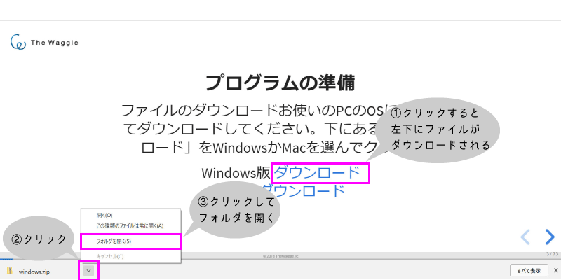
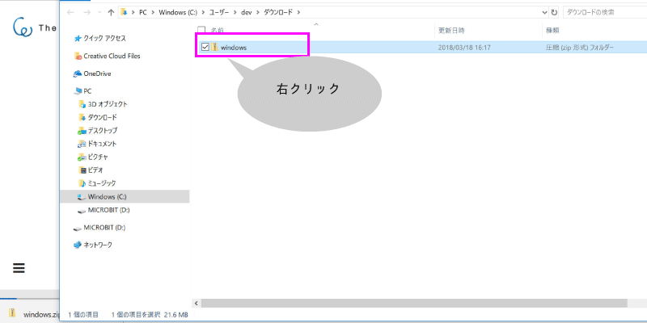
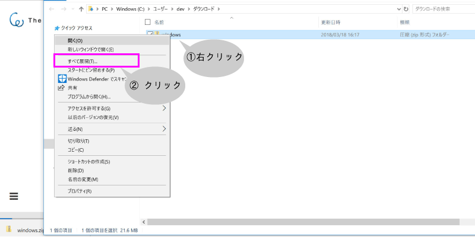
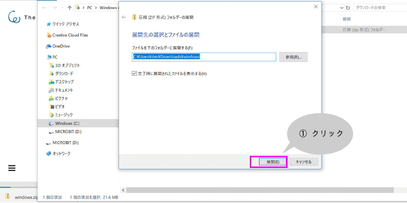
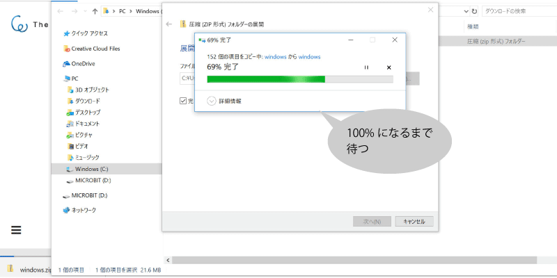
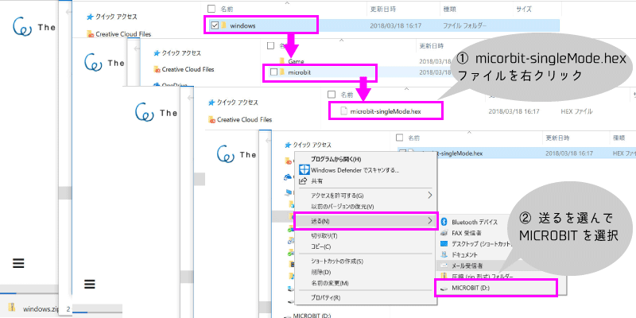
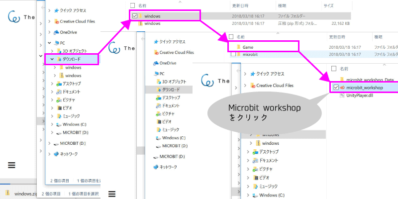
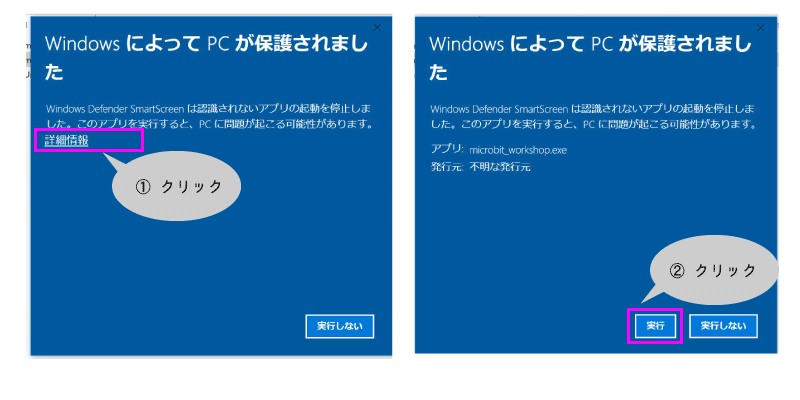
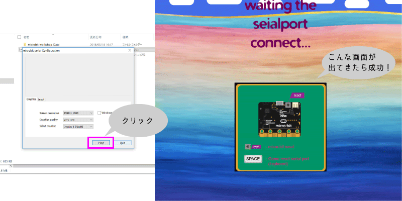

# Windowsでの取り込み方
---
### コントローラの準備2(Windows)

---

---

---

---

---

---
### Microbitにプログラムを入れたら次はゲームスタート！
---
#### microbit workshopファイルをクリック

---

---

---
[遊んで学んで-デジタルコンテンツの裏側を見てみよう](https://gitpitch.com/Yoosuke/Microbit_Event_Aizu#/9)に戻る
